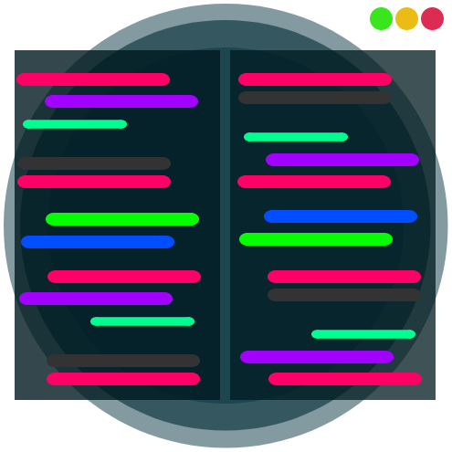
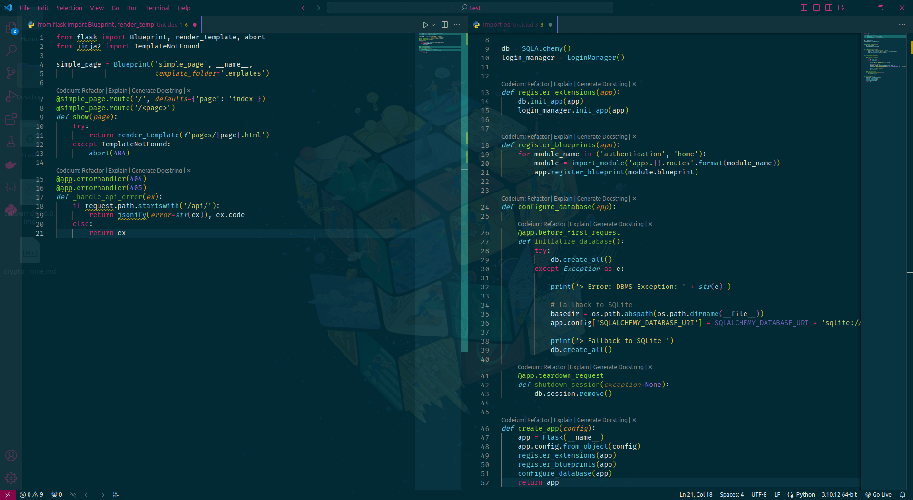
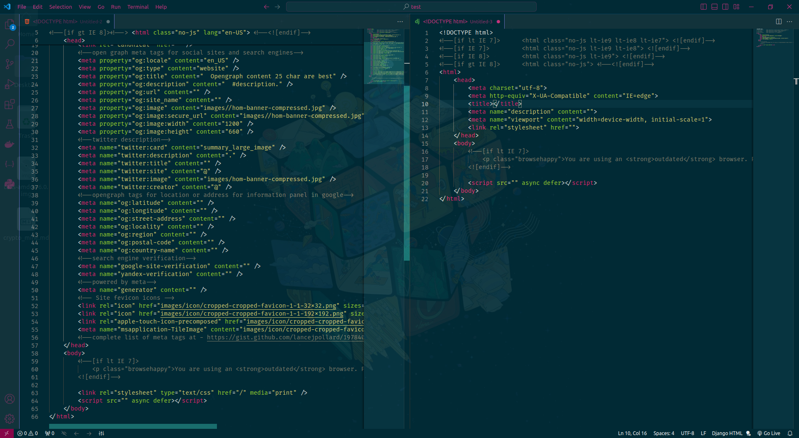
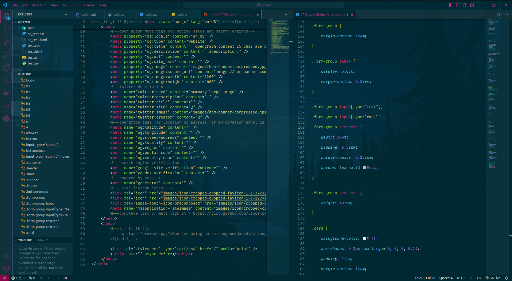

<h1 align="center">
  <br>
  <a href="link"></a>
  <br>
  GotZen
  <br>
</h1>

<h4 align="center">A Visual Studio Code Color-Theme<a href="https://github.com/Qyfashae/gtz-theme" target="_blank"> GotZen</a>.</h4>

<br>

<p align="center">
  <a href="#key-features">Key Features</a> •
  <a href="#config-setup">Config</a> •
  <a href="#based-on">Based On</a> •
  <a href="#credits">Credits</a> •
  <a href="#license">License</a>
</p>



## Key Features

* Bright and colorful syntax
* Easy background and foreground colors
* Color-breaks from calm colors to alerting colors
* <b>IF</b> you use the complete config file and follow through all setup you will also have:
* Transparent vscode window
* Colored top-panel, bot-panel, tab-modification, drop-shadows, minimap config and keymappings

## Config & Setup

Dependencies needed 'Python3.*', 'git', 'vscode' and below.

```bash
# Setup
$ cd && cd Downloads/
$ git clone https://github.com/qyfashae/gotzen-theme-vscode
$ sudo mv gotzen-theme-vscode gotzen-theme
$ sudo mkdir /usr/share/code/resources/app/extensions/gotzen && sudo ln -s /usr/share/code/resources/app/extensions/gotzen-theme
$

# Config
$ sudo apt update -y && sudo apt install -y && sudo apt upgrade -y && sudo apt autoremove -y 
$ cd gotzen && sudo python3 run.py
```

> **Note**
> If you're using Linux Bash for Windows, [see this guide](https://www.howtogeek.com/261575/how-to-run-graphical-linux-desktop-applications-from-windows-10s-bash-shell/) or use `node` from the command prompt.

## Based On

Built upon Monokai & my configuration, colors, syntax & more.
Colors also inspired from Solarized.

## Credits

This software uses the following open source packages:

https://github.com/qyfashae
  * Monokai
  * Solarized
  


## License

MIT

---

> [qyfashae](https://github.com/qyfashae) &nbsp;&middot;&nbsp;


